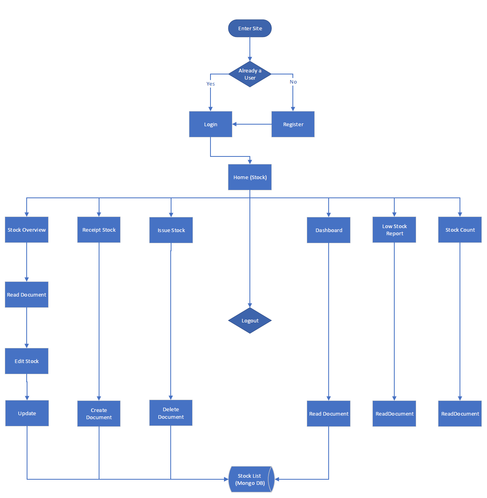

# Safe Stock

[View here for Safe Stock Inventory Management](https://safe-stock-77310870f391.herokuapp.com/login)

# Table of Contents

1. [Safe Stock](#safe-stock)
   - [Project Goals](#project-goals)
   - [C.R.U.D](#crud)
   - [User Experience (UX)](#user-experience)
      - [User Stories](#user-stories)
         - [First Time Visitor Goals](#first-time-visitor-goals)
         - [Returning Visitor Goals](#returning-visitor-goals)
         - [Frequent Visitors Goals](#frequent-visitors-goals)
      - [Testing User Stories](#testing-user-stories)
   - [Data Structure](#data-structure)
   - [Process Map](#process-map)
   - [Colour Scheme](#colour-scheme)
   - [Imagery](#imagery)
   - [Project Design Plan](#project-design-plan)
      - [Login](#login)
      - [Areas That Changed During Development](#areas-that-changed-during-development)
   - [Features](#features)
      - [Future Updates](#future-updates)
   - [Technologies Used](#technologies-used)
      - [Languages Used](#languages-used)
      - [Frameworks, Libraries & Programs Used](#frameworks-libraries--programs-used)
   - [Testing](#testing)
      - [HTML](#html)
      - [CSS](#css)
      - [JS](#js)
      - [Lighthouse Testing](#lighthouse-testing)
      - [User Stories Testing](#user-stories-testing)
      - [User Feedback](#user-feedback)
   - [Deployment](#deployment)
      - [Mongo DB](#mongo-db)
      - [Forking the GitHub Repository](#forking-the-github-repository)
      - [Deploying to Heroku](#deploying-to-heroku)
      - [Making a Local Clone](#making-a-local-clone)
   - [Credits](#credits)
      - [Content](#content)
      - [Acknowledgments](#acknowledgements)

# Project Goals
Safe Stock is crafted for the straightforward management of stock in small businesses, eliminating complexity from the process. It empowers users with the flexibility to oversee both incoming and outgoing stock effortlessly. Users can seamlessly review stock levels and rectify any discrepancies promptly, ensuring accurate and well-maintained stock levels.

Additionally, users have the convenience of monitoring stock levels and user engagement through an intuitive dashboard. In instances where understanding the reason behind stock changes becomes crucial, the system provides a last transaction user stamp. This feature allows users to review and identify the individual responsible for the latest transaction for each item.

Safe Stock employs MongoDB as its non-relational database for efficient data storage and retrieval.

## C.R.U.D

1. C - Create - Receipt Stock
2. R - Read - Stock Overveiw & Low Stock report
3. U - Update - Stock Overveiw - Edit
4. D - Delete - Issue Stock 

# User Experience (UX)

##  <b>User Stories</b>

### First Time Visitor Goals

1.  As a first time visitor, I want to view what data is being stored.
2.  As a first time visitor I want to bring stock to account and have a variety of different data ranging across multple different identifiers to support with traceability and stock control. 
3.  As a first time visitor, I want to issue stock from account to keep stock accurate with stock movement out of the business and data base.
4. As a first-time visitor,  I want to navigate the website easily and have clear access to all pages of the site.

### Returning Visitor Goals

1. As a returning visitor, I want to check stock levels.
2. As a returning visitor, I want to check stock accuracy and know if there are discrepancies within the stock.
3. As a returning visitor, I want to look at stock that needs to be reordered.
 

### Frequent Visitors Goals

1. As a frequent user, I want to see a dashboard that shows stock levels and users.
2. As a frequent user, I want to investigate stock discrepancies by reviewing the stock levels and seeing who was last to adjust any of the stock.
3. As a frequent user, I want to search for a specific item by searching for the name when reviewing stock levels.

## Testing User Stories

First Time Visitor

1. First time visitor was able to navigate to the stock overveiw screen.
2. User was able to receipt stock to account without any errors.
3. User was able to issue stock from account without any errors.

Returning Visitor

1. User found it simple to check the stock on the overveiw report.
2. User was able to navigate to stock check and input stock details into check accuracy.
3. User was able to navigate to low stock report and was able to explain what they would use this report would be used for.

Frequent Visitor

1. The user was able to navigate to the dashboard and was able to outline the importance of both graphs. 
2. The User to see what user completed the last transaction.
3. The user was able to search for a specific stock item.

### Data Structure

1. Data structure that is used in Mongo DB and interfaces into Safe Stock.

### Process Map

1. Process map shows how the system will interact with Mongo DB and how the transactions will interface.

### Colour Scheme

1. I chose the color palette as I believe the shades of blue and grey give a professional feel. 

### Imagery

1. All images were selected from [Shutterstock](https://www.shutterstock.com). I looked for perfossional setting images with the hero image linking to learning.

# Project design plan
 

## Login 

1. Login page stayed to similar design, this is simplistic and clear for user to complete goal..

2. Home screen remained similar to original design however. the live version has more transactions than originally planned due to ensuring that C.R.U.D could be clearly shown throughout the system. 

 

3. The stock report also stayed to the planned design just with extra columns to allow more data to be presented to the user.

 

4. Receipt stock design stayed similar to design. I would change the colour of the form to a lighter colour for this part of the design.

  

5. Issue stock stayed stayed similar to initial design, again I would change the form colours and more the text more clearer if done again.

 

6. Move stock was not used in the final production.

7. Dashboard added during production.

8. Low stock report added during production.

9. Stock Count added during production.

## Areas that changed during development

* I increased the amount of transactions to ensure that the system would support the user with more tasks.
* I removed the move stock feature as this was not going to have the controls I wanted being that my aim was to have a dynamic schema and not fixed.
* I added low stock page, this would be used to remind the user to re-order stock when the levels hit a certain threshold. Future development of this would be to allow the user to set the threshold.
* I added a dashboard to track KPI's for the system. Future development would be a selection of data the user could request to capture the desired KPI in a multitude of graphs including histograms with trend lines.
* I added a stock count process, this is to enable the user to do a blind stock count and will give the user access to update the system to the correct findings.

# Features

* Nav-Bar - Professional and centered for user focus.

* Nav-Bar dropdown used with mobile.

* Login Page.

 * Register for user to create an account.

* Access page for site, links to all transaction pages.

* Stock overview page which shows the stock list taken from MONGO DB.

 * Edit stock, edit documents and change stock levels.

 

* Receipt stock, adds a document to Mongo DB which can then be viewed on the stock overview page. 

* Issue Stock, deletes a line off Mongo DB which can be viewed in the stock overview. 

* Dashboard view KPI's. 

* Low Stock report, filters for all stock levels 5 and below, this is used for the user to re-order stock. 

* Stock count page, used for when the user is checking stock. Transaction will tell the user if the details are correct, if not the user will be sent to the stock overview page to change the stock. 

## Future Updates

1. Stock overview will have a search bar so the users can view selective data.
2. Issue transaction will be simplified and will be drop downs to stock user error causing problems with issuance.
3. Master data for locations and stock details will mean easier searching and stock could be moved locations.
4. Cycle counting to ensure all lodactions are checked once a month.
5. Change password for login page.
6. More graphs for dashboard.
7. mutiple reports including Transaction history, Purchase order history etc...
8. Purchase order planned delivery dates which can be used in conjunction with on time in full report.
9. electronic registers, this would be used for bespoke business requirments such as safety checks of racking and out of scope system work.
10. Barcode creation to allow easire access and scanning for a better user experience.

# Technologies Used

## Languages Used

* HTML5
* CSS3
* JS
* python
* Heroku
* Mongo DB
* Flask

## Frameworks, Libraries & Programs Used

1. Bootstrap 4.4.1
* Bootstrap was used to support only with the Nav Bar and Footer.
2. Git
* Git was used for version control by utilizing the Gitpod terminal to commit to Git and Push to GitHub. 
3. GitHub
* Github was used to store project coding after being pushed.
4. Balsamic
*  Balsamic was used to support with design and planning.
5. Shutterstock 
* Shutterstock was used to format images.
6. Stack Overflow
* Supported with debugging across the different functions.
7. Slack
* Supported with mutiple issues with deploying and dockerfile queries.
8. Mongo DB
* Database for the software.
9. Heroku
* Cloud server for deployment.
10. Gitpod
* Gitpod used to code.

# Testing

### HTML

The W3C Markup Validator was used to validate every page of HTML code.

* Only errors are for Jinja but not anything that has any serious impact on the code or integrity of the system.

### CSS

* The following shows no CSS errors found at W3C Validator: 

### Python

* Only line too long warnings, future developments i will look for code which will decrease my line sizes to able a more PEP8 compliant system.

### Lighthouse testing

* Lighthouse shows areas could be improved regarding some images positioning and file sizes which could affect the durability of the website if in the red.
* Main objective for myself was to have an accessibility score of over 90% as seen by the foillowing images the site has a score of 98%.

## User Stories Testing

## Test 1

|Action                                         |                       Expected Result                        | Actual Result |
|:-----------------------------------------------|:------------------------------------------------------------:|--------------:|
| I want to Access the register page and register a new user and password. |Flash message will appear to confirm creation  |   As expected |

https://github.com/Nick8735/Safe_Stock/assets/110351696/fbb632d4-76c3-491d-9bb9-5b233fabe863

 

## Test 2

|Action                                         |                       Expected Result                        | Actual Result |
|:-----------------------------------------------|:------------------------------------------------------------:|--------------:|
| I have registered I want to return to login. | Press already register button to go back to login. |   As expected |

 

## Test 3

|Action                                         |                       Expected Result                        | Actual Result |
|:-----------------------------------------------|:------------------------------------------------------------:|--------------:|
| I want to login with my new account. | login via login box. |   As expected |

https://github.com/Nick8735/Safe_Stock/assets/110351696/3d789c58-3994-4132-a08b-8b507035e5fc

 

## Test 4

|Action                                         |                       Expected Result                        | Actual Result |
|:-----------------------------------------------|:------------------------------------------------------------:|--------------:|
| If I put in the incorrect details do I still login. | User receives flash message stating incorrect details and does not progress. |   As expected |

https://github.com/Nick8735/Safe_Stock/assets/110351696/ca64d5b6-bb9d-4726-bbba-ca171633244c

 

## Test 5

|Action                                         |                       Expected Result                        | Actual Result |
|:-----------------------------------------------|:------------------------------------------------------------:|--------------:|
| I want to go to the home page. | user will be at the home page after login|   As expected |

https://github.com/Nick8735/Safe_Stock/assets/110351696/cc26a0e1-b3bc-48c9-a674-7b4b05ab1c97

 

## Test 6

|Action                                         |                       Expected Result                        | Actual Result |
|:-----------------------------------------------|:------------------------------------------------------------:|--------------:|
| Does the Navbar buttons work. | Each NavBar button will take the user to each specific transaction.|   As expected |

https://github.com/Nick8735/Safe_Stock/assets/110351696/5476bfc8-98fd-488c-96e3-c9e415477b43

 

## Test 7

|Action                                         |                       Expected Result                        | Actual Result |
|:-----------------------------------------------|:------------------------------------------------------------:|--------------:|
| Where to find stock the stock list taken from Mongo DB and shown on site. | User will click on stock overview and see full stock list taken from Mongo DB|   As expected |

https://github.com/Nick8735/Safe_Stock/assets/110351696/c66771d6-6435-47a8-b77d-e24b89ad7b76

 

## Test 8

|Action                                         |                       Expected Result                        | Actual Result |
|:-----------------------------------------------|:------------------------------------------------------------:|--------------:|
| Does the receipt button work. | User will click on Receipt and a form will show |   As expected |

https://github.com/Nick8735/Safe_Stock/assets/110351696/39e5e775-494b-4458-98b6-f0e9f0b17582

 

## Test 9

|Action                                         |                       Expected Result                        | Actual Result |
|:-----------------------------------------------|:------------------------------------------------------------:|--------------:|
| How do I create stock and view stock holdings. | User will complete receipt form and notification will appear to tell user stock is created. User will go to stock overview to check new row.|   As expected |

https://github.com/Nick8735/Safe_Stock/assets/110351696/739a9ef8-a146-420c-96fb-ab4f140b2c63

 

## Test 10

|Action                                         |                       Expected Result                        | Actual Result |
|:-----------------------------------------------|:------------------------------------------------------------:|--------------:|
| Has this row been created in Mongo DB and matches what is on the site in stock overview. | User will check stock overview then check the document in Mongo DB|   As expected |

https://github.com/Nick8735/Safe_Stock/assets/110351696/bcf8a21d-0896-4402-8f52-49c9312331ce

 

## Test 11

|Action                                         |                       Expected Result                        | Actual Result |
|:-----------------------------------------------|:------------------------------------------------------------:|--------------:|
| I want to Issue stock from account. | User will go to Issue transaction and complete form and get confirmation of issuance|   As expected |

https://github.com/Nick8735/Safe_Stock/assets/110351696/70878c6e-5747-4906-b1f9-40e89575218f

 

## Test 12

|Action                                         |                       Expected Result                        | Actual Result |
|:-----------------------------------------------|:------------------------------------------------------------:|--------------:|
| Has the Row been deleted in Mongo DB. | User will check stock overview to see that row is deleted then will check Mongo DB for the document|   As expected |

https://github.com/Nick8735/Safe_Stock/assets/110351696/9424f7eb-ad48-45ec-8b2c-8c4771e06e06

 

## Test 13

|Action                                         |                       Expected Result                        | Actual Result |
|:-----------------------------------------------|:------------------------------------------------------------:|--------------:|
| I want to see a graph on stock holding, qty. | User will navigate to the Dashboard transaction on the home page and verify one coloumn against the stock overview to see if it is correct. |   As expected |

https://github.com/Nick8735/Safe_Stock/assets/110351696/1ed0af9a-d928-4d21-9a8e-356c7dc2038b

 

## Test 14

|Action                                         |                       Expected Result                        | Actual Result |
|:-----------------------------------------------|:------------------------------------------------------------:|--------------:|
| I want to edit my stock holding. | User will go to stock overview and press edit, user will adjust Qty and submit, user will get a message to stock holdings have been changed. |   As expected |

https://github.com/Nick8735/Safe_Stock/assets/110351696/131ed80e-b2ef-4d92-80e4-eeeb742f74a2

 

## Test 15

|Action                                         |                       Expected Result                        | Actual Result |
|:-----------------------------------------------|:------------------------------------------------------------:|--------------:|
| Has the document in Mongo DB been adjusted from the edit in stock overview. | User will check stock overview then go to Mongo DB and check the document for the change. |   As expected |

https://github.com/Nick8735/Safe_Stock/assets/110351696/5f1ca2bf-3eb0-4b7b-a95c-65bfd769ad40

 

## Test 16

|Action                                         |                       Expected Result                        | Actual Result |
|:-----------------------------------------------|:------------------------------------------------------------:|--------------:|
| I want my stock holdings that have a qty 5 or below to show on the low stock report. | user will check low stock report then go to stock overview and make a qty over 5 down to a number less than 5, once done user will check the low stock report to see if row has appeared. |   As expected |

https://github.com/Nick8735/Safe_Stock/assets/110351696/147a2e7c-e410-4c0b-9b2d-9c21aa0e1b9b

 

## Test 17

|Action                                         |                       Expected Result                        | Actual Result |
|:-----------------------------------------------|:------------------------------------------------------------:|--------------:|
| I want to check that if I get a stock increase over 5 on an item it will be removed from the low stock report. | User will check the low stock report for a row and will then go to the stock overview and increase the qty, user will then check this against the low stock report to see that row has disappeared |   As expected |

https://github.com/Nick8735/Safe_Stock/assets/110351696/df7d4586-69a5-45f9-92bf-e23f035a8fae

 

## Test 18

|Action                                         |                       Expected Result                        | Actual Result |
|:-----------------------------------------------|:------------------------------------------------------------:|--------------:|
| When checking physical stock I want input my findings and get a message to tell me my stock is correct. | user will access the stock count menu and fill in the form with current stock details and press the button |   As expected |

https://github.com/Nick8735/Safe_Stock/assets/110351696/a2e358ec-16e3-4b28-add1-a9021cf665ca

## Test 19

|Action                                         |                       Expected Result                        | Actual Result |
|:-----------------------------------------------|:------------------------------------------------------------:|--------------:|
| I want to be told if my stock has a discrepancie during a stock count. | User will go to stock count and input incorrect details on the form user will get a message to say stock is incorrect. |   As expected |

https://github.com/Nick8735/Safe_Stock/assets/110351696/73543ec9-4570-4849-91f2-d57edf82b421

## Test 20

|Action                                         |                       Expected Result                        | Actual Result |
|:-----------------------------------------------|:------------------------------------------------------------:|--------------:|
| I want to logout. | user will press the logout button in Navbar |   As expected |

https://github.com/Nick8735/Safe_Stock/assets/110351696/baba31f6-3a03-4cc9-9355-7f4a4bbe90a3

## Bugs During Development

1. Unable to determine why the low stock report was not working, added print queries to validate that data was being pulled from Mongo DB. Data showed correctly in terminal but did not show on the report. On review of the documents in Mongo DB I could see that the default ID for Qty was set as string instead of INT32. After change in Mongo low stock report worked as expected.

## User Feedback

* Website was accessed by multiple family and friends who gave the following feedback for bugs and suggestions.

* Chris - The Software is very simple and logical which would make it easier for people to use, I would like to see less typing in details and more populated fields on future updates, this will help decrease errors and make the system even easier to use. 

* Simon - I could see small businesses using this software to account for small store stock levels and help increase stock traceability and usage. I would love to see further development and watch this piece of software grow with further updates. I like the messages that appear after a successful transaction, it is good to not have to always keep pressing ok when one pops up like you do on a lot of systems. 

# Deployment

## Mongo DB

1. Go to Mongo DB and create a new acount.
2. Create a cluster.
3. Select AWS for cloud provider.
4. Select closest region.
5. Choose M0 cluster tier.
6. Create Cluster Name.
7. Press create database access.
8. Create a username and password.
9. Ensure user privilege is read and write to DB.
10. Click add user.
11. Click on netwrok access and click ad IP address and select allow access from anywhere.
12. Click on your cluster tab and click on collection button.
13. click add my own data and create your database name and collection.
14. click on insert document in your database.
15. 
16. Install pip3 insall pymongo in terminal.

## Forking the GitHub Repository

By forking the GitHub Repository we make a copy of the original repository on our GitHub account to view and/or make changes without affecting the original repository by using the following steps...

1. Log in to GitHub and locate the GitHub Repository
2. At the top of the Repository (not top of page) just above the "Settings" Button on the menu, locate the "Fork" Button.
3. You should now have a copy of the original repository in your GitHub account.

## Deploying to Heroku

1. In your terminal enter $ pip3 freeze --local > requirments.txt.
2. Then use the echo web: python app.py > Procfile to create files for flask.
3. login to Heroku and click on the new button to create a new app.
4. Connect to your Github Repository on the deploy page in heroku.
5. Go to Heroku settings tab and goto your Config Var and add in your variables
6. Enable automatic deployment and click Deploy.
7. Set up environment on Heroku by going to Settings tab.
8. On Config Vars section, click Reveal Config Vars
9. Based on env.py file, add all the environment variables to the Config Vars section.

## Making a Local Clone

1. Log in to GitHub and locate the GitHub Repository
2. Under the repository name, click "Clone or download".
3. To clone the repository using HTTPS, under "Clone with HTTPS", copy the link.
4. Open Git Bash
5. Change the current working directory to the location where you want the cloned directory to be made.
6. Type git clone, and then paste the URL you cpoied in step 3

Press Enter. Your local clone will be created.

* Cloning into `CI-Clone`...
* remote: Counting objects: 10, done.
* remote: Compressing objects: 100% (8/8), done.
* remove: Total 10 (delta 1), reused 10 (delta 1)
* Unpacking objects: 100% (10/10), done.

# Credits

* [W3Schools](https://www.w3schools.com/) for support with bugs and coding errors.

* [Materialize](https://materializecss.com/) Used to support with navigation bar and card creation.

* [Shutterstock](https://www.shutterstock.com/) for all images.

* [Balsamiq](https://balsamiq.com/) For Wireframes.

## Content

All content was written by the developer.

## Acknowledgemts 
* My College Tutor for continuous support and understanding throughout.
* My Mentor for great feedback and support.
* My partner who looked after the kids while I tapped away.
