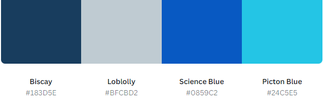

# Safe Stock

[View here for Safe Stock Inventory Management](https://safe-stock-77310870f391.herokuapp.com/login)

# Project Goals
Safe Stock is crafted for the straightforward management of stock in small businesses, eliminating complexity from the process. It empowers users with the flexibility to oversee both incoming and outgoing stock effortlessly. Users can seamlessly review stock levels and rectify any discrepancies promptly, ensuring accurate and well-maintained stock levels.

Additionally, users have the convenience of monitoring stock levels and user engagement through an intuitive dashboard. In instances where understanding the reason behind stock changes becomes crucial, the system provides a last transaction user stamp. This feature allows users to review and identify the individual responsible for the latest transaction for each item.

Safe Stock employs MongoDB as its non-relational database for efficient data storage and retrieval.

## C.R.U.D

1. C - Create - Receipt Stock
2. R - Read - Stock Overveiw & Low Stock report
3. U - Update - Stock Overveiw - Edit
4. D - Delete - Issue Stock 

# User Experience (UX)

##  <b>User Stories</b>

### First Time Visitor Goals

1.  As a first time visitor, I want to view what data is being stored.
2.  As a first time visitor I want to bring stock to account and have a variety of different data ranging across multple different identifiers to support with traceability and stock control. 
3.  As a first time visitor, I want to issue stock from account to keep stock accurate with stock movement out of the business and data base.
4. As a first-time visitor,  I want to navigate the website easily and have clear access to all pages of the site.

### Returning Visitor Goals

1. As a returning visitor, I want to check stock levels.
2. As a returning visitor, I want to check stock accuracy and know if there are discrepancies within the stock.
3. As a returning visitor, I want to look at stock that needs to be reordered.
 

### Frequent Visitors Goals

1. As a frequent user, I want to see a dashboard that shows stock levels and users.
2. As a frequent user, I want to investigate stock discrepancies by reviewing the stock levels and seeing who was last to adjust any of the stock.
3. As a frequent user, I want to search for a specific item by searching for the name when reviewing stock levels.

## Testing User Stories

* Diane - Chef

First Time Visitor

1. First time visitor was able to navigate to the stock overveiw screen.
2. User was able to receipt stock to account without any errors.
3. User was able to issue stock from account without any errors.

Returning Visitor

1. User found it simple to check the stock on the overveiw report.
2. User was able to navigate to stock check and input stock details into check accuracy.
3. User was able to navigate to low stock report and was able to explain what they would use this report would be used for.

Frequent Visitor

1. The user was able to navigate to the dashboard and was able to outline the importance of both graphs. 
2. The User to see what user completed the last transaction.
3. The user was able to search for a specific stock item.

# Design

### Colour Scheme

1. I chose the color palette as I believe the shades of blue and grey give a professional feel. 

### Imagery

1. All images were selected from [Shutterstock](https://www.shutterstock.com). I looked for perfossional setting images with the hero image linking to learning.

# Project design plan
 

## Login 

1. Login page stayed to similar design, this is simplistic and clear for user to complete goal..

2. Home screen remained similar to original design however. the live version has more transactions than originally planned due to ensuring that C.R.U.D could be clearly shown throughout the system. 

 

3. The stock report also stayed to the planned design just with extra columns to allow more data to be presented to the user.

 

4. Receipt stock design stayed similar to design. I would change the colour of the form to a lighter colour for this part of the design.

  

5. Issue stock stayed stayed similar to initial design, again I would change the form colours and more the text more clearer if done again.

 

6. Move stock was not used in the final production.

7. Dashboard added during production.

8. Low stock report added during production.

9. Stock Count added during production.

## Areas that changed during development

* I increased the amount of transactions to ensure that the system would support the user with more tasks.
* I removed the move stock feature as this was not going to have the controls I wanted being that my aim was to have a dynamic schema and not fixed.
* I added low stock page, this would be used to remind the user to re-order stock when the levels hit a certain threshold. Future development of this would be to allow the user to set the threshold.
* I added a dashboard to track KPI's for the system. Future development would be a selection of data the user could request to capture the desired KPI in a multitude of graphs including histograms with trend lines.
* I added a stock count process, this is to enable the user to do a blind stock count and will give the user access to update the system to the correct findings.

# Features

* Nav-Bar - Professional and centered for user focus.

* Nav-Bar dropdown used with mobile.

* Login Page.

 * Register for user to create an account.

* Access page for site, links to all transaction pages.

* Stock overview page which shows the stock list taken from MONGO DB.

 * Edit stock, edit documents and change stock levels.

 

* Receipt stock, adds a document to Mongo DB which can then be viewed on the stock overview page. 

* Issue Stock, deletes a line off Mongo DB which can be viewed in the stock overview. 

* Dashboard view KPI's. 

* Low Stock report, filters for all stock levels 5 and below, this is used for the user to re-order stock. 

* Stock count page, used for when the user is checking stock. Transaction will tell the user if the details are correct, if not the user will be sent to the stock overview page to change the stock. 

## Future Updates

1. Having a data capture system which allows users to veiw overall test completion.
2. Sign up sheet that allows the user to have a personalised certificate on completion, this will support traceability of completed tests.
3. A way to input new procedures and tests, maybe an online form.
4. Timed testing.
5. Work instruction training set out a bit differently but tested the same way.
6. Set individual training goals.

# Technologies Used

## Languages Used

* HTML5
* CSS3
* JS

## Frameworks, Libraries & Programs Used

1. Bootstrap 4.4.1
* Bootstrap was used to support only with the Nav Bar and Footer.
2. Git
* Git was used for version control by utilizing the Gitpod terminal to commit to Git and Push to GitHub. 
3. GitHub
* Github was used to store project coding after being pushed.
4. Balsamic
*  Balsamic was used to support with design and planning.
5. Shutterstock 
* Shutterstock was used to format images.
6. W3Schools 
* supported with adding link to function in JS.
* supported with avice on Stopping of the next button function when incorrect answer is performed.

# Testing

### HTML

The W3C Markup Validator was used to validate every page of HTML code.

* 0 errors with only one warning which has no impact on the user or integrity on the site.

### CSS

* The following shows CSS errors found at W3C Validator: 

Errors were for oversights in my code. 

* Errors rectified and validation complete.

### JS 

* The following validation was done with JS Hint.

* The following errors found were for missing semicolon that was an oversight that has now been corrected.

 
 
 

* Errors corrected

### Lighthouse testing

* Lighthouse shows areas could be improved regarding some images positioning and file sizes which could affect the durability of the website if in the red.
* Main objective for myself was to have an accessibility score of over 90% as seen by the foillowing images the site has a score of 98%.

## User Stories Testing

## Test 1

|Action                                         |                       Expected Result                        | Actual Result |
|:-----------------------------------------------|:------------------------------------------------------------:|--------------:|
| I want to use Nav-Bar to access Demo's 1 and 2 | Dropdown will appear and links will take user to destination |   As expected |

 

## Test 2

|Action                                         |                       Expected Result                        | Actual Result |
|:-----------------------------------------------|:------------------------------------------------------------:|--------------:|
| I want to navigate to demo button and open Manufacturing Procedure. | Procedure page will be visable. |   As expected |

 

## Test 3

|Action                                         |                       Expected Result                        | Actual Result |
|:-----------------------------------------------|:------------------------------------------------------------:|--------------:|
| I want to navigate to test button and select manufacturing test 1. | Test page will be visable. |   As expected |

 

## Test 4

|Action                                         |                       Expected Result                        | Actual Result |
|:-----------------------------------------------|:------------------------------------------------------------:|--------------:|
| I want to select the correct answer which will then highlight green. | Answer highlighted in green. |   As expected |

 

## Test 5

|Action                                         |                       Expected Result                        | Actual Result |
|:-----------------------------------------------|:------------------------------------------------------------:|--------------:|
| I want to select the wrong answer. | correct answer will highlight in green, incorrect answer will highlight in red and link back to procedure will be visable within correct answer. The next button will not show for the next question|   As expected |

 

## Test 6

|Action                                         |                       Expected Result                        | Actual Result |
|:-----------------------------------------------|:------------------------------------------------------------:|--------------:|
| Complete question 5. | Next screen will show the result and inform user test complete|   As expected |

 

## Test 7

|Action                                         |                       Expected Result                        | Actual Result |
|:-----------------------------------------------|:------------------------------------------------------------:|--------------:|
| Press complete button. | Next screen will show a certificate|   As expected |

 

## Test 8

|Action                                         |                       Expected Result                        | Actual Result |
|:-----------------------------------------------|:------------------------------------------------------------:|--------------:|
| Press Home button from Nav-Bar. | Be taken to Home screen|   As expected |

 

## Test 9

|Action                                         |                       Expected Result                        | Actual Result |
|:-----------------------------------------------|:------------------------------------------------------------:|--------------:|
| Press contact us in Nav-Bar. | Be taken to Contact us|   As expected |

 

## Test 10

|Action                                         |                       Expected Result                        | Actual Result |
|:-----------------------------------------------|:------------------------------------------------------------:|--------------:|
| Fill in form and submit. | Be taken to thank you page|   As expected |

 

## Test 11

|Action                                         |                       Expected Result                        | Actual Result |
|:-----------------------------------------------|:------------------------------------------------------------:|--------------:|
| Press Home button in Nav-Bar. | Be taken to Home page|   As expected |

 

## Test 12

|Action                                         |                       Expected Result                        | Actual Result |
|:-----------------------------------------------|:------------------------------------------------------------:|--------------:|
| Press incorrect answer on test and select hyperlink. | Be taken to procedure page|   As expected |

 

## Test 13

|Action                                         |                       Expected Result                        | Actual Result |
|:-----------------------------------------------|:------------------------------------------------------------:|--------------:|
| I want to navigate to first-aid demo button . | Navigate to procedure page. |   As expected |

 

## Test 14

|Action                                         |                       Expected Result                        | Actual Result |
|:-----------------------------------------------|:------------------------------------------------------------:|--------------:|
| I want to navigate to first-aid test button . | Start first-aid test. |   As expected |

 

## Test 15

|Action                                         |                       Expected Result                        | Actual Result |
|:-----------------------------------------------|:------------------------------------------------------------:|--------------:|
| I want to select correct answer . | correct answer highlights green and next button appears. |   As expected |

 

## Test 16

|Action                                         |                       Expected Result                        | Actual Result |
|:-----------------------------------------------|:------------------------------------------------------------:|--------------:|
| I want to select incorrect answer . | correct answer highlights green and incorrect highlights red, hyperlink appears in correct answer and next button does not appears. |   As expected |

 

## Test 17

|Action                                         |                       Expected Result                        | Actual Result |
|:-----------------------------------------------|:------------------------------------------------------------:|--------------:|
| I want to select incorrect answer and select hyperlink. | correct answer highlights green and incorrect highlights red, hyperlink appears in correct answer and next button does not appears. Hyperlink will take me to the procedure page |   As expected |

 

## Test 18

|Action                                         |                       Expected Result                        | Actual Result |
|:-----------------------------------------------|:------------------------------------------------------------:|--------------:|
| I want to select each icon in the footer. | Be taken to each social media page |   As expected |

## User Feedback

* Website was accessed by multiple family and friends who gave the following feedback for bugs and suggestions.

1. Andrew - The website is very simple and easy to use, as a shift manager I need to be confident that the systems we use for training will result in skilled workers. The way the system is presented pushes the user to leanr when unsure. My only criticism was a question that could of been easily misconstured for something else which you re-worded.

2. Wendy - I believe this kind of training system is a must for businesses with large amounts of employees. Updates down the line I would like to see some statistics of who has completed the tests and who has struggled. This would help me understand which of my employees need more support. Great job! 

# Deployment

## GitHub Pages

The project was deployed to GitHub Pages using the following steps...

1. Log in to GitHub and locate the GitHub Repository
2. At the top of the Repository (not top of page), locate the "Settings" Button on the menu. Alternatively Click Here for a GIF demonstrating the process starting from Step 2.
3. Scroll down the Settings page until you locate the "GitHub Pages" Section.
4. Under "Source", click the dropdown called "None" and select "Master Branch".
5. The page will automatically refresh.
6. Scroll back down through the page to locate the now published site link in the "GitHub Pages" section.

## Forking the GitHub Repository

By forking the GitHub Repository we make a copy of the original repository on our GitHub account to view and/or make changes without affecting the original repository by using the following steps...

1. Log in to GitHub and locate the GitHub Repository
2. At the top of the Repository (not top of page) just above the "Settings" Button on the menu, locate the "Fork" Button.
3. You should now have a copy of the original repository in your GitHub account.

## Making a Local Clone

1. Log in to GitHub and locate the GitHub Repository
2. Under the repository name, click "Clone or download".
3. To clone the repository using HTTPS, under "Clone with HTTPS", copy the link.
4. Open Git Bash
5. Change the current working directory to the location where you want the cloned directory to be made.
6. Type git clone, and then paste the URL you cpoied in step 3

$ git clone https://github.com/Nick8735/Training

Press Enter. Your local clone will be created.

$ git clone https://github.com/Nick8735/Training

* Cloning into `CI-Clone`...
* remote: Counting objects: 10, done.
* remote: Compressing objects: 100% (8/8), done.
* remove: Total 10 (delta 1), reused 10 (delta 1)
* Unpacking objects: 100% (10/10), done.

# Credits

* [W3Schools](https://www.w3schools.com/) for support with bugs and coding errors.

* [Bootstrap5.3](https://getbootstrap.com/) Used to support with navigation bar.

* [Shutterstock](https://www.shutterstock.com/) for all images.

* [Balsamiq](https://balsamiq.com/) For Wireframes.

## Content

All content was written by the developer.

## Acknowledgemts 
* My College Tutor for continuous support and understanding throughout.
* My Mentor for great feedback and support.
* My partner who looked after the kids while I tapped away.
